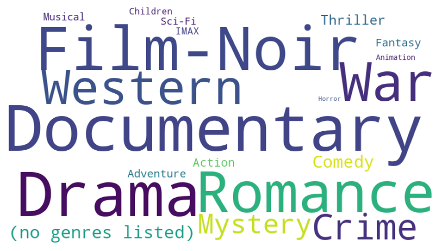
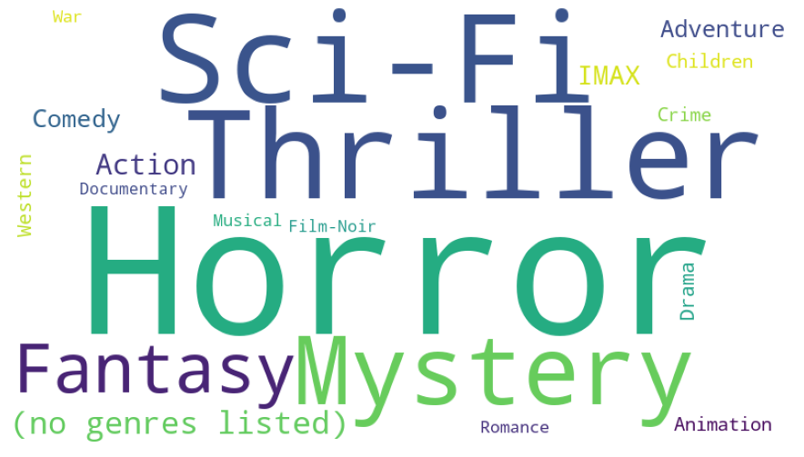

Photo by <a href="https://unsplash.com/@foodess?utm_source=unsplash&utm_medium=referral&utm_content=creditCopyText">Food Photographer | Jennifer Pallian</a> on <a href="/s/photos/cookie?utm_source=unsplash&utm_medium=referral&utm_content=creditCopyText">Unsplash</a>

The code is available here [https://github.com/millengustavo/floc-experiment](https://github.com/millengustavo/floc-experiment)

# The end of third-party cookies for advertisers

Third-party cookies have (since 1994) been a key enabler of the commercial Internet and **fine-grained digital ad targeting**

They helped achieve **unprecedented audience segmentation and attribution** - helping to connect marketing tactics with results in ways that were virtually impossible in the most traditional forms of media.

To bring users more transparency and better consent management, most browsers are ending support for third-party cookies.

- [Firefox 79 clears redirect tracking cookies every 24 hours](https://venturebeat.com/2020/08/04/mozilla-firefox-79/)
- [Apple teases new tracking protections and an approximate location feature in iOS 14](https://www.theverge.com/2020/6/22/21299407/apple-ios-14-new-privacy-features-data-location-tracking-premissions-wwdc-2020)
- [Google has announced plans to stop supporting third-party cookies on its Chrome browser in 2021](https://blog.chromium.org/2020/01/building-more-private-web-path-towards.html)

Some alternatives are being proposed to replace the need for third-party cookies, ensuring users' privacy, but without loss of performance for advertisers.

In this post you will learn a little more about **FLoC**, an alternative proposed by Google, and we will navigate through a simplified demonstration of the algorithm using a public dataset.

# FLoC's Goal
> **"Preserve interest based advertising, but in a privacy-preserving manner"**

## Overview
- Relies on a **cohort** assigning mechanism: a function that allocates a cohort id to a user based on their **browsing history**
- This cohort id **must be shared by at least k distinct users** for privacy

## Privacy x Utility
> "The more users share a cohort id, the **harder it is to derive individual** user's behavior from across the web. On the other hand, a large cohort is more likely to have a diverse set of users, thus making it harder to use this information for **fine-grained ads personalization** purposes."

**Ideal cohort assignment**: group together a large number of users interested in similar things

## Intersections with Data Science
- [Federated Learning](https://federated.withgoogle.com/): machine learning technique that trains an algorithm across multiple decentralized edge devices or servers holding local data samples, **without exchanging them**
- Cohort assignment algorithm should be **unsupervised**, since each provider has their own optimization function

# Evaluating Google's approach on a public dataset
- Let's evaluate [SimHash](https://static.googleusercontent.com/media/research.google.com/pt-BR//pubs/archive/33026.pdf) (originally developed to identify near duplicate documents quickly) proposed in the FLoC whitepaper as a cohort assignment mechanism using the dataset **MovieLens 25M**

> "MovieLens 25M movie ratings. Stable benchmark dataset. 25 million ratings and one million tag applications applied to 62,000 movies by 162,000 users."


## Installing the SimHash Python package
```python
!git clone https://github.com/scrapinghub/python-simhash
!cd python-simhash && python setup.py install
```

```python
import pandas as pd
import numpy as np
import matplotlib.pyplot as plt
from sklearn.preprocessing import MultiLabelBinarizer
from wordcloud import WordCloud
from simhash import weighted_fingerprint, fnvhash
```

## Downloading MovieLens 25m
```python
!wget https://files.grouplens.org/datasets/movielens/ml-25m.zip --no-check-certificate
!unzip ml-25m.zip
```

```python
movies = pd.read_csv("ml-25m/movies.csv")
ratings = pd.read_csv("ml-25m/ratings.csv")

# join movie genres with user ratings
df = ratings[["userId", "movieId", "rating"]].merge(movies[["movieId", "genres"]], on="movieId")
df["genres"] = df["genres"].apply(lambda x: x.split("|"))

# create a genre per column dataset
mlb = MultiLabelBinarizer(sparse_output=True)
transformed_df = df.join(
    pd.DataFrame.sparse.from_spmatrix(
        mlb.fit_transform(df.pop("genres")),
        index=df.index,
        columns=mlb.classes_,
    )
)

# multiply user rating to each genre to give us an idea of an weighted genre vector for each user
my_genres = [col for col in transformed_df.columns if col not in ["userId", "movieId", "rating"]]
for genre in my_genres:
    transformed_df[genre] = transformed_df["rating"] * transformed_df[genre]
    transformed_df[genre] = np.asarray(transformed_df[genre]).astype("int8")

# compute each user's mean genre vector
transformed_df = transformed_df.drop(columns=["rating", "movieId"])
transformed_df = transformed_df.groupby(by="userId").mean()
```

## SimHash

Having computed each users' mean genre vector preferences, we can compute the SimHash on this vector, so each user interest will be represented by some hash of all of his preferences combined (with collisions)

```python
def simhash(v):
    v = dict(v)
    return weighted_fingerprint([(fnvhash(k), w) for k, w in v.items()])

transformed_df['hash'] = transformed_df.apply(simhash, axis=1)
```

- We can see that we have a lot of collisions using SimHash, but this is expected, since many users share similar preferences and our choice of hashing algorithm is intentional
- SimHash is computationally inexpensive by design, not caring too much about hash collisions

## Defining a limited number of clusters for demonstration purposes
```python
transformed_df["cluster"] = pd.cut(transformed_df["hash"], bins=5, labels=["1", "2", "3", "4", "5"])
results = transformed_df.drop(columns='hash').groupby('cluster').mean()
```

## Visualizing the clusters
```python
def plot_cluster_wordcloud(cluster_name):
    cluster_text = results.loc[results.index == str(cluster_name)].to_dict(orient='records')[0]
    wordcloud = WordCloud(width=800, height=450, background_color="white").generate_from_frequencies(cluster_text)
    plt.figure(figsize=(16,9))
    plt.imshow(wordcloud)
    plt.axis("off");
```

## Cluster 1
> Action, Adventure, Western, IMAX

```python
plot_cluster_wordcloud(1)
```


## Cluster 2
> Drama, Romance

```python
plot_cluster_wordcloud(2)
```



## Cluster 3
> Crime, Documentary, Mistery, Film-Noir

```python
plot_cluster_wordcloud(3)
```


## Cluster 4
> Horror, Sci-Fi, Thriller

```python
plot_cluster_wordcloud(4)
```



## Cluster 5
> Animation, Children, Comedy, Fantasy, Musical

```python
plot_cluster_wordcloud(5)
```


# Conclusion

With the growing concern for users' privacy, some machine learning techniques have shown promise. **Federated learning** seems to be an interesting alternative for this type of application and it is worth studying it further.

I recommend that you read more about [Privacy Sandbox](https://blog.google/products/ads-commerce/2021-01-privacy-sandbox), Chrome's initiative to, according to Google, "help publishers and advertisers succeed, while protecting people's privacy."

# References
- https://www.deloittedigital.com/us/en/blog-list/2020/what-the-end-of-third-party-cookies-means-for-advertisers.html
- https://venturebeat.com/2020/08/04/mozilla-firefox-79/
- https://www.theverge.com/2020/6/22/21299407/apple-ios-14-new-privacy-features-data-location-tracking-premissions-wwdc-2020
- https://blog.chromium.org/2020/01/building-more-private-web-path-towards.html
- https://github.com/google/ads-privacy/blob/master/proposals/FLoC/FLOC-Whitepaper-Google.pdf
- https://blog.google/products/ads-commerce/2021-01-privacy-sandbox
- https://github.com/scrapinghub/python-simhash
- https://towardsdatascience.com/federated-learning-of-cohorts-googles-cookie-killer-7f63b2395173